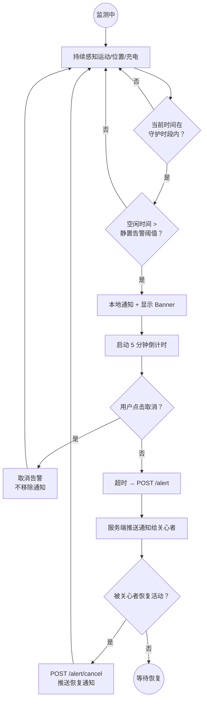
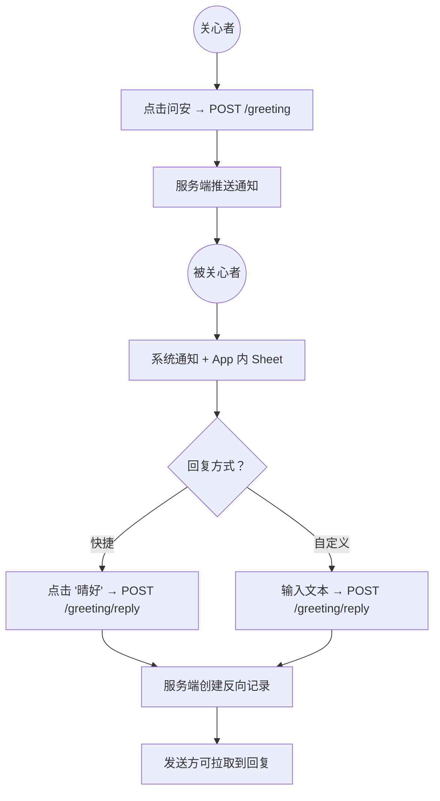
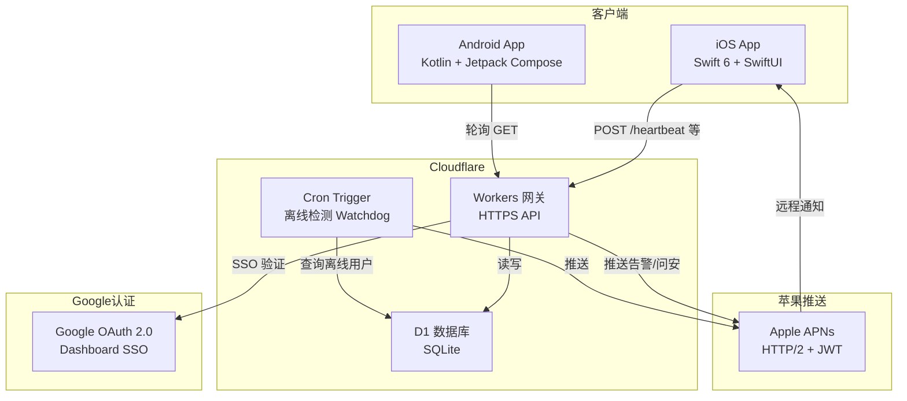
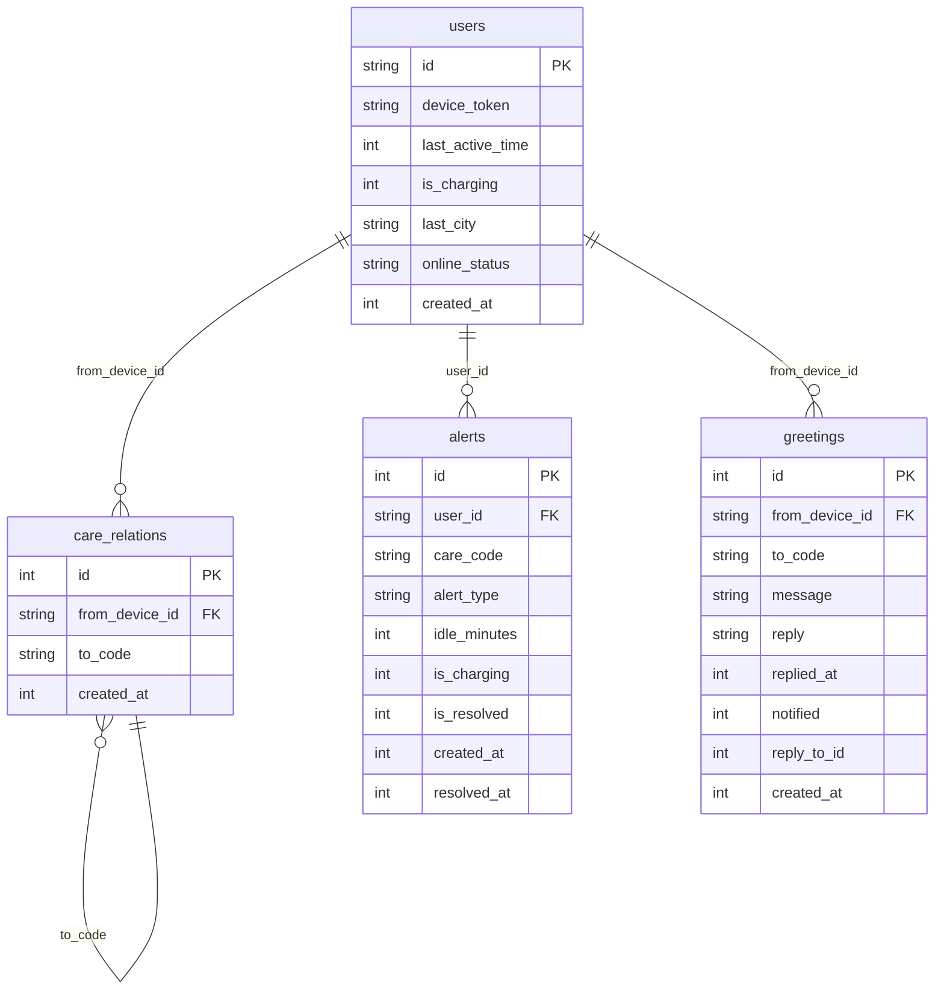
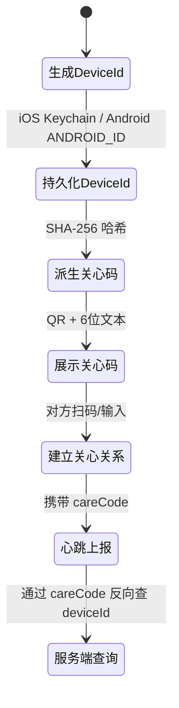
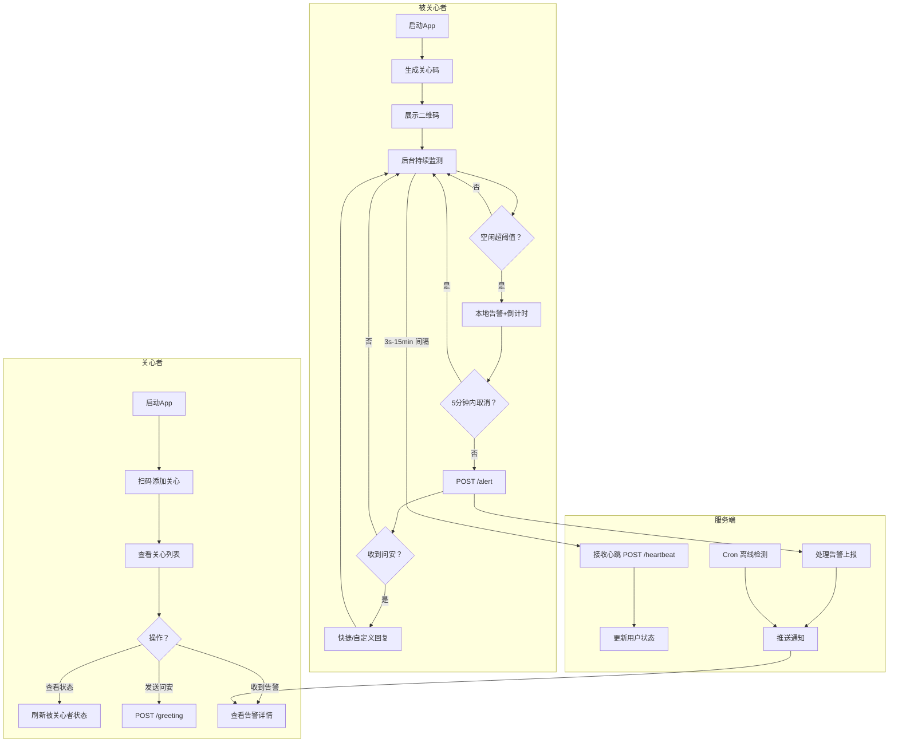

# 产品需求文档 (PRD)

## 文档信息

| 项目 | 内容 |
|------|------|
| 文档版本 | V1.0 |
| 编写日期 | 2026-07-29 |
| 编写人 | LLM 生成 |
| 所属项目 | 晴好 StillHere — 独居安全守护 App |
| 文档状态 | 草稿 |

> ⚠️ 来源追溯：所有结论标注出处，格式为「审查产物 > 章节」。

---

## 一、产品概述

### 1.1 产品愿景

**晴好**（StillHere）是一款面向独居人群的安全监测 App。被关心者安装 App 后，系统通过手机传感器自动感知活动状态（运动、位置、充电），定时上报心跳。当长时间无活动时自动告警给家人，让关心永不缺席。

> 来源：1.1_review_requirement.md > 审查要点 #1

### 1.2 项目背景

- **社会痛点**：独居老人、独居青年面临突发疾病/意外无法求救的风险，传统"定时打电话"方式不可靠。
- **现有方案缺陷**：手环/摄像头方案需要额外硬件、侵犯隐私；手动打卡 App 体验差、用户难以坚持。
- **核心思路**：利用手机传感器被动感知活动，零人工干预；通过关心码建立信任关系，保护隐私。

> 来源：1.1_review_requirement.md > 审查要点 #1, #2；LLM 推断 > 依据：idea.md 原始方案

### 1.3 产品目标

| 目标类型 | 目标描述 | 衡量指标 | 来源 |
|----------|----------|----------|------|
| 用户目标 | 被关心者在日常使用手机时无需主动操作，系统自动守护 | 无活动告警触发延迟 ≤ 阈值时间 + 5 分钟缓冲 | 1.1_review_requirement.md > #9 |
| 用户目标 | 关心者可随时查看被关心者状态，收到告警后及时响应 | 告警通知到达率 > 95% | 1.1_review_requirement.md > #11 |
| 业务目标 | 通过设备匿名标识 + 关心码机制保护用户隐私，零 PII 采集 | 服务端无手机号/姓名等个人身份数据 | 1.2_review_standard.md > #6 |
| 业务目标 | 基于 Cloudflare 免费方案运行，零独立服务器成本 | 月度运营成本 < $5 | 1.2_review_standard.md > #15 |

---

## 二、用户分析

### 2.1 用户角色

| 角色 | 职责 | 核心诉求 | 使用频率 | 来源 |
|------|------|----------|----------|------|
| 被关心者 | 安装 App 接受监测，活动异常时产生告警 | 无需频繁打卡；隐私不被侵犯；告警及时通知家人 | 后台持续运行 | 1.1_review_requirement.md > #2 |
| 关心者 | 添加关心关系，接收告警通知，查看状态，发送问安 | 及时获知家人异常；操作简单；信息可靠 | 每日查看 / 告警时响应 | 1.1_review_requirement.md > #2 |
| 开发者 | 运维服务端，查看运营数据 | 通过 Dashboard 查看用户量、活跃度、告警统计 | 按需 | 1.3_review_tech.md > #12 |

### 2.2 用户场景

#### 系统用户

| 端 | 用户类型 | 职责 | 来源 |
|------|----------|------|------|
| 移动端 | 被关心者 | 接受活动监测，管理关心我的人 | 1.1_review_requirement.md > 🗺️ |
| 移动端 | 关心者 | 管理关心列表，查看状态，发送问安，响应告警 | 1.1_review_requirement.md > 🗺️ |
| Web | 开发者/运营 | 通过 Dashboard 查看运营数据，管理用户和告警 | 1.3_review_tech.md > 🗺️ |

#### 对接系统

| 系统名 | 对接方式 | 数据流向 | 说明 | 来源 |
|--------|----------|----------|------|------|
| Apple APNs | HTTP/2 + JWT | 出 | 向 iOS 关心者推送告警和问安通知 | 1.3_review_tech.md > 审查要点 #4 |
| Google OAuth | OAuth 2.0 | 入 | Dashboard 管理后台 SSO 认证 | 1.3_review_tech.md > 审查要点 #10 |
| Cloudflare IP Geo | 边缘请求 `request.cf.city` | 入 | 获取用户 IP 归属城市 | 1.2_review_standard.md > 审查要点 #9 |

#### 端与场景

| 端 | 场景 | 说明 | 来源 |
|------|------|------|------|
| 移动端 | 生成关心码 | App 首次启动生成 Device ID 和 6 位关心码，可展示二维码 | 1.1 > 🗺️ #1 |
| 移动端 | 添加关心 | 扫码或手动输入关心码建立关心关系 | 1.1 > 🗺️ #2 |
| 移动端 | 关心列表 | 查看我关心的人、关心我的人，删除关系 | 1.1 > 🗺️ #3 |
| 移动端 | 活动监测 | 后台感知运动/位置/充电，生成活动事件 | 1.1 > 🗺️ #4 |
| 移动端 | 心跳上报 | 前台 3s / 后台 60s-15min 上报心跳 | 1.1 > 🗺️ #5 |
| 移动端 | 静置告警 | 超阈值触发告警 + 5 分钟取消窗口 | 1.1 > 🗺️ #6 |
| 移动端 | 接收告警 | 关心者收到告警通知（iOS APNs / Android 轮询） | 1.1 > 🗺️ #7 |
| 移动端 | 发送问安 | 向被关心者发送问安消息 | 1.1 > 🗺️ #8 |
| 移动端 | 回复问安 | 快捷回复或自定义文本回复 | 1.1 > 🗺️ #9 |
| 移动端 | 状态查询 | 查看被关心者活跃时间、充电、城市 | 1.1 > 🗺️ #10 |
| 移动端 | 守护时段 | 配置守护时段，仅时段内触发告警 | 1.1 > 🗺️ #11 |
| Server | 心跳接收 | API 接收心跳，更新用户状态 | 1.1 > 🗺️ Server #1 |
| Server | 关系管理 | /care 创建/删除关系 | 1.1 > 🗺️ Server #2 |
| Server | 告警管理 | /alert 管理告警生命周期 | 1.1 > 🗺️ Server #3 |
| Server | 问安管理 | /greeting 管理问安收发 | 1.1 > 🗺️ Server #4 |
| Server | 离线检测 | Cron 5min 检测超 24h 无心跳用户 | 1.1 > 🗺️ Server #5 |
| Web | Dashboard | 数据看板（用户/告警/问安统计） | 1.3_review_tech.md > 🗺️ |

#### 场景详述

**场景一：关心码生成与展示**

> 作为 被关心者，我想要 生成我的唯一关心码并展示二维码，以便 让家人可以通过扫码添加我。

- **来源**：1.1_review_requirement.md > 🗺️ 第 1 行
- **前置条件**：App 首次启动，或用户主动查看关心码
- **操作流程**：
  1. App 首次启动 → 生成 UUID Device ID → 存入 Keychain（iOS）/ ANDROID_ID 派生（Android）
  2. SHA-256(Device ID) → hex[8:14) → 6 位大写关心码
  3. 展示关心码文本 + 二维码（内容为关心码字符串）
  4. 卸载重装后关心码不变
- **预期结果**：用户获得唯一的 6 位永久关心码

**场景二：静置告警触发与通知**

> 作为 关心者，我想要 在被关心者长时间无活动时收到通知，以便 及时确认对方安全。

- **来源**：1.1_review_requirement.md > 🗺️ 第 6-7 行
- **前置条件**：已建立关心关系，被关心者处于守护时段内
- **操作流程**：
  1. 被关心者设备空闲超过阈值（默认 30 分钟）
  2. 本地触发告警：系统通知 + App 内 Banner 显示倒计时
  3. 5 分钟内被关心者可点击「取消」→ 告警撤销
  4. 5 分钟超时未取消 → `POST /alert` 上报服务端
  5. 服务端推送给所有关心者（iOS APNs / Android 轮询拉取）
  6. 被关心者恢复活动 → `POST /alert/cancel` → 推送恢复通知
- **预期结果**：关心者在告警触发后及时收到通知

**场景三：问安收发**

> 作为 关心者，我想要 向被关心者发送问安消息，以便 表达关心并获取对方回复。

- **来源**：1.1_review_requirement.md > 🗺️ 第 8-9 行
- **前置条件**：已建立关心关系
- **操作流程**：
  1. 关心者选择某位被关心者 → 点击「问安」→ 发送预设消息（"晴好"）
  2. `POST /greeting`，服务端推送通知给被关心者
  3. 被关心者收到系统通知 + App 内弹出回复 Sheet
  4. 被关心者点击快捷回复「晴好」或输入自定义文本 → `POST /greeting/reply`
  5. 服务端创建反向问安记录，原发送方可拉取到回复
- **预期结果**：双方完成一次问安交互

---

## 三、功能需求

### 3.1 功能清单

| 编号 | 模块 | 功能点 | 描述 | 优先级 | 依赖 | 来源 |
|------|------|--------|------|--------|------|------|
| F001 | 身份 | 生成 Device ID | 首次启动生成唯一设备标识 | P0 | 无 | 1.1 > #3 |
| F002 | 身份 | 生成关心码 | SHA-256(Device ID) → 6 位大写码 | P0 | F001 | 1.1 > #3 |
| F003 | 身份 | 关心码持久化 | 卸载重装后关心码不变（Keychain / ANDROID_ID） | P0 | F001 | 1.1 > #4 |
| F004 | 关系 | 展示关心码 | 展示 6 位码 + 二维码供对方扫描 | P0 | F002 | 1.1 > #5 |
| F005 | 关系 | 扫码添加 | 扫描对方关心码二维码建立关系 | P0 | F004 | 1.1 > #5 |
| F006 | 关系 | 手动输入添加 | 输入 6 位关心码建立关系 | P0 | F004 | 1.1 > #5 |
| F007 | 关系 | 关心列表 | 展示我关心的人列表（含本地昵称） | P0 | F005/F006 | 1.1 > #5 |
| F008 | 关系 | 被关心列表 | 展示关心我的人关心码列表 | P0 | F005/F006 | 1.1 > #5 |
| F009 | 关系 | 删除关心 | 解除关心关系 | P1 | F007 | 1.1 > #5 |
| F010 | 关系 | 互关标识 | 标记双向关心关系 | P2 | F007/F008 | 1.1 > #5 |
| F011 | 监测 | 运动感知 | 计步器 + 活动转换检测运动 | P0 | 无 | 1.1 > #6 |
| F012 | 监测 | 位置变化 | SLC / 持续定位检测位置变化 | P0 | 无 | 1.1 > #6 |
| F013 | 监测 | 充电状态 | 监测充电/断电事件 | P0 | 无 | 1.1 > #6 |
| F014 | 监测 | 前台唤醒 | App 在前台时重置空闲计时器 | P0 | 无 | 1.1 > #6 |
| F015 | 监测 | 守护时段配置 | 可配置多个守护时段，仅时段内触发告警 | P1 | 无 | 1.1 > #7 |
| F016 | 心跳 | 前台心跳 | 每 3 秒 POST /heartbeat | P0 | F001 | 1.1 > #8 |
| F017 | 心跳 | 后台心跳 | iOS 后台 60s / Android WorkManager 15min | P0 | F001 | 1.1 > #8 |
| F018 | 告警 | 静置告警阈值 | 可配置 5-120 分钟（5 分钟档位） | P0 | F016 | 1.1 > #9 |
| F019 | 告警 | 充电忽略 | 可配置充电时是否忽略告警 | P1 | F013 | 1.1 > #10 |
| F020 | 告警 | 告警倒计时 | 触发告警后 5 分钟取消窗口 | P0 | F018 | 1.1 > #9 |
| F021 | 告警 | 告警上报 | 超时未取消 → POST /alert | P0 | F020 | 1.1 > #9 |
| F022 | 告警 | 告警取消 | 恢复活动后 POST /alert/cancel | P0 | F018 | 1.1 > #9 |
| F023 | 告警 | 告警通知 | 推送给关心者（iOS APNs / Android 本地） | P0 | F021/F022 | 1.1 > #11 |
| F024 | 问安 | 发送问安 | 关心者向被关心者发送消息 | P1 | F007 | 1.1 > #12 |
| F025 | 问安 | 快捷回复 | 点击"晴好"快捷回复 | P1 | F024 | 1.1 > #12 |
| F026 | 问安 | 自定义回复 | 输入文本回复问安 | P2 | F024 | 1.1 > #12 |
| F027 | 问安 | 问安通知 | 收到问安时系统通知 + App 内展示 | P1 | F024 | 1.1 > #12 |
| F028 | 状态 | 关心对象状态 | 批量查询被关心者活跃/充电/城市 | P0 | F007 | 1.1 > #13 |
| F029 | 后台 | 离线检测 | Cron 每 5 分钟检测超 24h 无心跳 | P1 | F017 | 1.1 > #9 |
| F030 | Dashboard | 数据看板 | Google SSO 登录 → 用户/告警/问安统计 | P1 | 无 | 1.3 > #12, #13 |
| F031 | Dashboard | 公开页面 | Landing Page + 隐私条款 + 功能说明 | P2 | 无 | 1.3 > #8 |

### 3.2 功能详述

#### F001-F003 设备身份

**功能描述**：App 首次启动生成唯一设备 ID，通过 SHA-256 单向哈希派生出 6 位关心码。iOS 使用 Keychain 存储，Android 使用 ANDROID_ID 确定性派生，确保卸载重装后关心码不变。

**来源**：1.1_review_requirement.md > 审查要点 #3, #4

**用户故事**：
> 作为 被关心者，我想要 一个永久的关心码，即使卸载重装 App 也不会变，以便 家人始终能通过同一个码找到我。

**业务规则**：
- `careCode = SHA-256(deviceId) → hex[8:14) → uppercase`（6 位大写）
- iOS: deviceId 存在 Keychain（service = `com.eastlakestudio.stillhere`）
- Android: deviceId = `SHA-256(Settings.Secure.ANDROID_ID) → 格式化为 UUID`
- 关心码不可反推 deviceId（单向哈希）
- 6 位码理论碰撞空间 16^6 ≈ 1677 万，实际用户量下可接受

**交互说明**：
- 默认状态：App 启动后自动生成（静默），用户可在"我的关心码"页面查看
- 边界情况：Android ANDROID_ID 为 null（极罕见）时回退到随机 UUID

**验收标准**：
- [ ] iOS 卸载重装后 Device ID 和关心码保持不变
- [ ] Android 卸载重装后 Device ID 和关心码保持不变
- [ ] 三端（iOS / Android / Server）`toCareCode()` 输出一致

**关联功能**：
- 被依赖：F004, F005, F006, F016

---

#### F011-F020 活动监测与告警

**功能描述**：通过手机传感器自动感知被关心者的活动状态。在守护时段内，若空闲超过阈值，触发本地倒计时，超时后上报服务端通知关心者。充电时可选择忽略告警。

**来源**：1.1_review_requirement.md > 审查要点 #6, #7, #9, #10

**用户故事**：
> 作为 被关心者，我想要 App 自动监测我的活动状态，在长时间未使用手机时通知我的家人，以便 他们在紧急情况下能及时确认我的安全。

**前置条件**：
- App 已授予运动、位置、通知权限
- 当前时间在已配置的守护时段内

**操作流程**：

**业务规则**：
- 静置告警阈值：默认 30 分钟，可配 5-120 分钟，5 分钟一档
- 守护时段外不触发告警；时段内空闲从窗口起始时间算起（非时段内空闲不计入）
- 充电时若开启"忽略充电告警"，不触发空闲告警
- 5 分钟倒计时内用户点击「取消」→ 清除计时器，不上报
- 后台定时任务（BGAppRefresh / WorkManager）不算用户活动，不重置空闲计时器
- 同一时段 5 分钟内不重复告警

**交互说明**：
- 默认状态：监测运行中，无可见 UI
- 告警触发：通知栏 + App 内顶部红色 Banner 显示"已 X 分钟无活动，5分钟内未取消将通知关心人"
- 取消操作：点击 Banner 上的「取消」按钮
- 错误状态：网络异常导致告警上报失败，本地仍保留告警状态

**验收标准**：
- [ ] 守护时段内空闲超过阈值触发告警
- [ ] 守护时段外空闲不触发告警
- [ ] 充电忽略开启时，充电状态下不触发告警
- [ ] 5 分钟倒计时内取消不上报服务端
- [ ] 超时后正确上报服务端，关心者收到通知
- [ ] 恢复活动后自动取消告警

**关联功能**：
- 依赖：F011, F012, F013, F014
- 被依赖：F021, F022, F023

---

#### F024-F027 问安系统

**功能描述**：关心者向被关心者发送问安消息（默认"晴好"），被关心者可快捷回复或输入自定义文本。已展示过的问安不重复推送通知。

**来源**：1.1_review_requirement.md > 审查要点 #12

**用户故事**：
> 作为 关心者，我想要 向被关心者发送问候消息并收到对方的回复，以便 确认对方安好。

**前置条件**：
- 已建立关心关系
- 网络连接正常

**操作流程**：

**业务规则**：
- 问安默认消息为"晴好"
- 服务端 `notified` 标志位防止同一条问安重复通知
- 回复时创建反向问安记录（`reply_to_id` 指向原记录），防止无限链式
- 客户端 BackgroundWorker（Android）和前台轮询均做通知 ID 去重

**交互说明**：
- 加载状态：发送问安时按钮显示 loading
- 空状态：无问安消息时不弹出 Sheet

**验收标准**：
- [ ] 关心者发送问安成功，被关心者收到通知
- [ ] 被关心者快捷回复和自定义回复均可发送成功
- [ ] 发送方可拉取到回复消息
- [ ] 已展示过的问安不重复推送通知

**关联功能**：
- 依赖：F007
- 被依赖：F025, F026, F027

---

## 四、明确不做（Out of Scope）

| 编号 | 内容 | 原因 | 后续计划 |
|------|------|------|----------|
| N001 | FCM 推送（Firebase Cloud Messaging） | 需 Google Play Services，增加依赖 | 永不，Android 用轮询替代 |
| N002 | 手机号/邮箱注册登录 | 隐私优先设计，零 PII 采集 | 永不 |
| N003 | 实时位置追踪 / 地图展示 | 隐私约束，仅服务端存 IP 归属城市 | 永不 |
| N004 | 视频/语音通话 | 超出核心安全监测场景 | V2.0 评估 |
| N005 | 多人家庭群组管理 | 当前只有一对一关心关系 | V2.0 评估 |
| N006 | 微信小程序版本 | 已有内置 UI 模板，但非本期目标 | 后续迭代 |
| N007 | 大屏态势监控看板 | 已有内置 UI 模板，预留给未来场景 | 后续迭代 |

---

## 五、非功能需求

> 来源：从审查产物中提取，标注出处。

### 5.1 性能要求

| 指标 | 要求 | 来源 |
|------|------|------|
| 心跳间隔 | 前台 3 秒，后台 60 秒（iOS）/ 15 分钟（Android） | 1.1 > #8 |
| 接口响应时间 | ≤ 3 秒（Cloudflare 边缘节点） | 1.3 > #3 |
| 告警延迟 | 阈值时间 + 5 分钟倒计时 | 1.1 > #9 |
| 问安到达延迟 | ≤ 15 分钟（Android 轮询间隔） | 1.2 > #11 |

### 5.2 安全要求

- 全链路 HTTPS 加密传输 — 来源：1.2 > #14
- Cloudflare Workers 作为 API 网关，所有请求经边缘节点 — 来源：1.3 > #3
- Android 无 FCM，不经过 Google 推送服务器 — 来源：1.2 > #11
- iOS APNs JWT 签名服务端直连，不引入第三方 SDK — 来源：1.2 > #12
- Dashboard 需 Google OAuth 2.0 SSO 认证，限定 mingh.liu@gmail.com — 来源：1.3 > #10, #11

### 5.3 兼容性要求

| 端 | 要求 | 来源 |
|------|------|------|
| iOS App | iOS 17.0+，Swift 6 + SwiftUI | 1.1 > #14 |
| Android App | Android 8.0+ (API 26)，Kotlin + Jetpack Compose | 1.1 > #14 |
| Web Server | Cloudflare Workers（全球边缘），Chrome/Firefox/Safari 最新版 | 1.2 > #4, #15 |
| Web Dashboard | PC 浏览器：Chrome / Firefox / Edge 最新 2 个版本 | 1.4 > pc.md |

### 5.4 隐私合规

- 禁止采集 PII：设备 UDID / IMEI / 手机号 / 身份证 / 精确位置 — 来源：1.2 > #6
- 昵称仅存客户端本地，不上传 — 来源：1.2 > #10
- 关心码 SHA-256 单向哈希，不可反推 Device ID — 来源：1.2 > #8
- 服务端不存精确 IP，仅存 Cloudflare 边缘 IP 归属城市 — 来源：1.2 > #9
- 公开隐私条款页面 `/privacy` — 来源：1.3 > #8

---

## 六、系统架构

### 6.1 系统架构图

### 6.2 核心实体关系图（E-R 图）

### 6.3 关心码身份体系

---

## 七、业务流程

### 7.1 核心业务流程图

---

## 八、依赖与风险

### 8.1 外部依赖

| 依赖项 | 提供方 | 影响 | 到位时间 | 来源 |
|--------|--------|------|----------|------|
| Cloudflare Workers | Cloudflare | 服务端运行平台，宕机则全部功能不可用 | 已就绪 | 1.2 > #4 |
| Cloudflare D1 | Cloudflare | 数据库，宕机则数据丢失 | 已就绪 | 1.2 > #5 |
| Apple APNs | Apple | iOS 远程推送，不可用则告警延迟 | 已就绪 | 1.3 > #4 |
| Google OAuth | Google | Dashboard SSO，不可用则无法登录管理后台 | 已就绪 | 1.3 > #10 |
| GitHub | GitHub | 代码托管，不可用不影响运行 | 已就绪 | 1.3 > #6 |
| APNs .p8 密钥 | Apple Developer | 推送签名凭据，需开发者账号维护 | 已持有 | 1.3 > #7 |

### 8.2 关键假设

- 假设用户日常使用手机（产生步数、位置、充电等事件）— 来源：LLM 推断，基于产品逻辑
- 假设 Android 设备支持 ANDROID_ID（API 26+ 均支持）— 来源：1.1 > #14
- 假设 iOS 用户允许后台定位和运动权限（否则监测不可用）— 来源：1.1 > #6
- 假设 Cloudflare Workers 每日免费额度 10 万次请求足以支撑当前用户规模 — 来源：LLM 推断

### 8.3 风险与缓解

| 风险 | 影响 | 概率 | 缓解措施 | 来源 |
|------|------|------|------|------|
| Android 无 FCM，告警延迟最多 15 分钟 | 中 | 高 | 前台保持 3 秒轮询；后续可考虑前台服务方案 | 1.2 > #11 |
| 关心码 6 位碰撞（1677 万空间） | 低 | 低 | 用户规模可控，碰撞概率极低 | 1.1 > #3 |
| Cloudflare Workers 冷启动延迟 | 低 | 中 | 边缘节点分布，中国用户访问可能受 GFW 影响 | 1.2 > #4 |
| Android 厂商杀后台导致监测中断 | 高 | 高 | WorkManager 兜底；需指导用户加白名单 | 1.1 > #8 |
| 用户拒绝权限导致监测不可用 | 高 | 中 | 权限引导页 + 仅影响告警功能，基础功能仍可用 | 1.1 > #6 |

### 8.4 待澄清问题

- Android 端技术栈：规范要求 Flutter，当前实现为 Kotlin + Compose，需明确最终方案 — 来源：1.2 > #2
- UI 规范中系统版本要求（iOS 15+ / Android 12+）与当前实现（iOS 17+ / Android 8+）不一致 — 来源：1.4 > #15

---

## 九、数据需求

### 9.1 数据来源

| 数据项 | 来源系统 | 更新频率 | 备注 |
|--------|----------|----------|------|
| 运动事件 | iOS CoreMotion / Android ActivityTransition | 实时事件 | 本地处理，不上报原始传感器数据 |
| 位置变化 | iOS SLC / Android LocationManager | 显著变化时 | 仅用于触发活动事件，不存坐标 |
| 充电状态 | iOS UIDevice / Android BatteryManager | 变化时 | 仅存 isCharging 布尔值 |
| 心跳 | 客户端主动上报 | 前台 3s / 后台 60s-15min | 携带 userId + careCode + isCharging |
| IP 归属城市 | Cloudflare `request.cf.city` | 每次心跳时 | 不存精确 IP |
| 问安消息 | 客户端 POST /greeting | 用户主动操作 | 存消息文本 + 回复 |

### 9.2 数据字典（核心表）

| 字段名 | 类型 | 必填 | 说明 | 来源 |
|--------|------|------|------|------|
| users.id | TEXT PK | 是 | 客户端 UUID（deviceId） | 1.1 > #17 |
| users.last_active_time | INTEGER | 否 | 最后活跃时间戳（秒） | 1.1 > #17 |
| users.is_charging | INTEGER | 否 | 是否充电 0/1 | 1.1 > #17 |
| users.online_status | TEXT | 否 | online / offline | 1.1 > #17 |
| care_relations.from_device_id | TEXT | 是 | 发起关心的设备 ID | 1.1 > #17 |
| care_relations.to_code | TEXT | 是 | 被关心方 6 位关心码 | 1.1 > #17 |
| alerts.alert_type | TEXT | 是 | idle / offline / online | 1.1 > #17 |
| alerts.idle_minutes | INTEGER | 否 | 空闲分钟数 | 1.1 > #17 |
| greetings.message | TEXT | 是 | 问安内容 | 1.1 > #17 |
| greetings.notified | INTEGER | 是 | 是否已通知客户端 0/1 | 1.1 > #17 |

---

## 十、附录

### 10.1 原型与设计

| 类型 | 路径 | 说明 |
|------|------|------|
| 原始方案 | `idea.md` | 初始系统设计文档 |
| 通信设计 | `doc/communication-design.md` | API 协议与数据库设计 |
| 开发者指南 | `AGENTS.md` | 编译命令与开发环境配置 |

### 10.2 参考文档

| 文档 | 路径 |
|------|------|
| 需求文档 | `specs/01_initial_demands/requirements.md` |
| 技术规范 | `specs/02_standards_and_regs/tech_standards.md` |
| 架构约束 | `specs/03_arch_constraints/architecture.md` |
| UI 规范 | `specs/04_ui_guidelines/mobile.md` |

### 10.3 术语表

| 术语 | 定义 |
|------|------|
| 关心码 (careCode) | 6 位大写字母数字码，由 Device ID 经 SHA-256 哈希派生，不可反推，用于建立关心关系 |
| Device ID | 设备唯一标识（UUID），全局 userId |
| 被关心者 | 安装 App 接受活动监测的人 |
| 关心者 | 添加关心关系、接收告警通知的人 |
| 守护时段 | 用户自定义的时间窗口，仅在此窗口内触发空闲告警 |
| 静置告警阈值 | 超过该时间无活动则触发告警（默认 30 分钟） |
| APNs | Apple Push Notification service，苹果远程推送服务 |
| FCM | Firebase Cloud Messaging，Google 推送服务（本项目不使用） |
| WorkManager | Android Jetpack 后台任务调度库 |
| Keychain | iOS 系统安全存储，数据在卸载重装后仍保留 |
