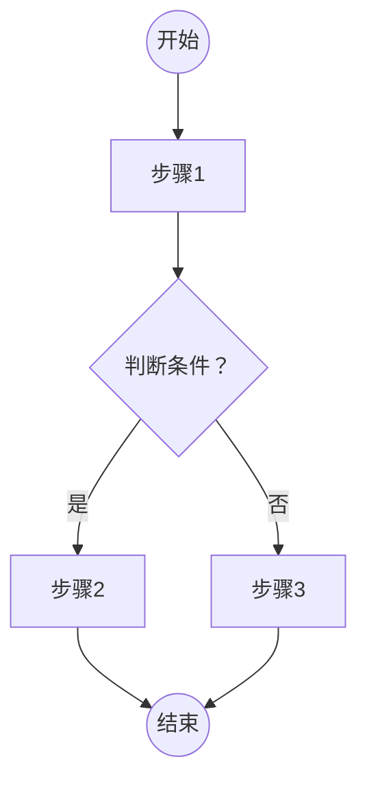
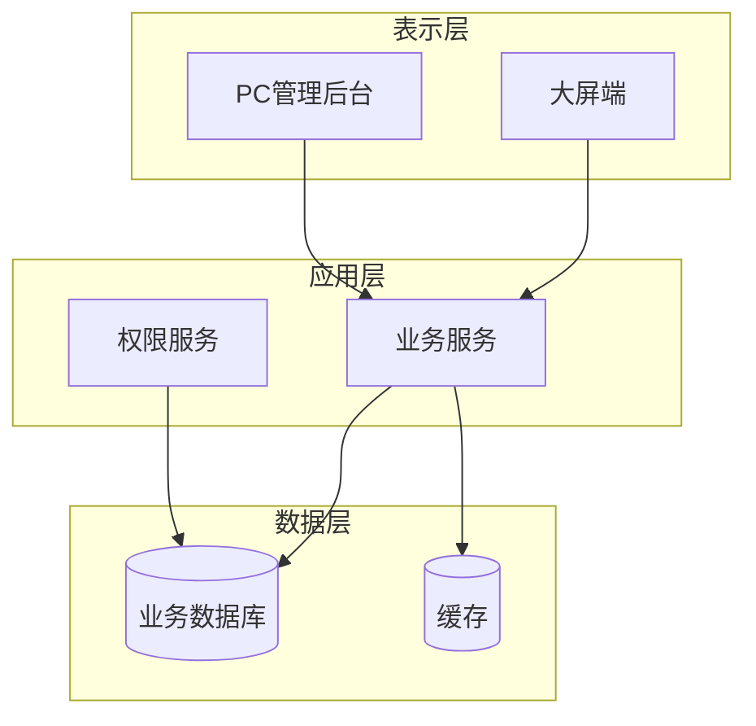
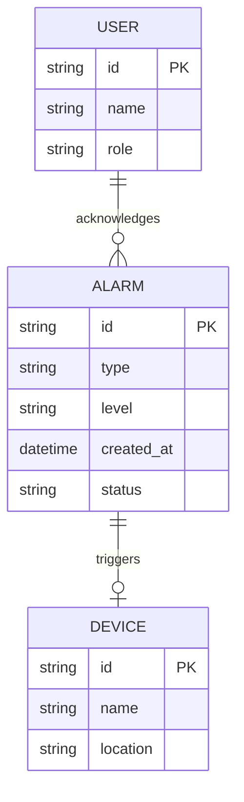
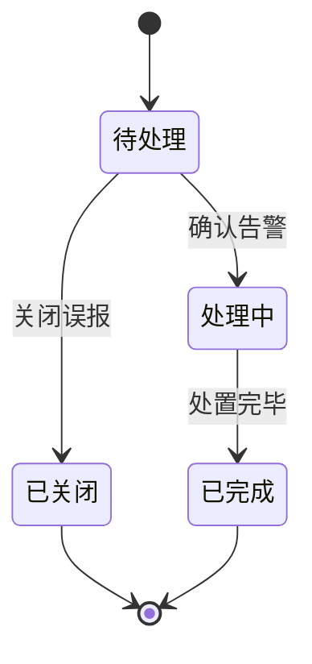
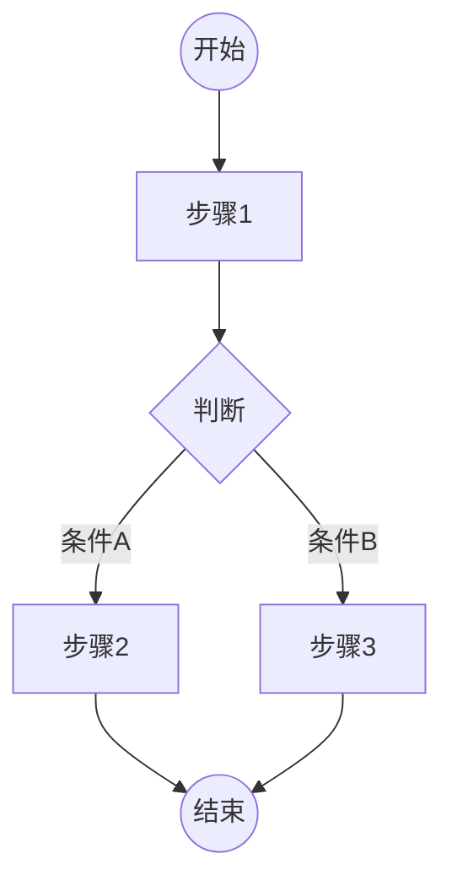

# 产品需求文档 (PRD)

## 文档信息

| 项目 | 内容 |
|------|------|
| 文档版本 | V1.0 |
| 编写日期 | {YYYYMMDD} |
| 编写人 | {姓名} |
| 所属项目 | {项目名称} |
| 文档状态 | 草稿 / 评审中 / 已确认 |

> ⚠️ **来源追溯规范**：本文档所有结论必须有据可查。LLM 填充每项内容时，必须在「来源」字段标注出处 — 格式为「文档名 > 章节名」，如「1.1_review_requirement.md > 终端与平台」或「合同.pdf > 第 5 页」。**来源标注的文件必须是当前项目中真实存在的文件（artifacts/ 或 specs/ 下）**，不得凭空编造不存在的文档名（如「用户角色与场景权限模型」）。若某项来自 LLM 基于审查产物的合理推断，标注为「LLM 推断 > 依据：{简述推理链}」。

---

## 一、产品概述

### 1.1 产品愿景

{2-3句话说明产品是什么、为谁服务、核心价值。如："为化工厂区值班人员提供统一的告警管理看板，将分散在多个系统的告警汇聚到一张图上，降低遗漏率。"}

### 1.2 项目背景

{为什么要做这个产品：政策要求、客户痛点、业务现状、数据支撑。引用调研结论或客户原话。}

### 1.3 产品目标

> 来源：从审查产物中提取量化指标，标注出处。

| 目标类型 | 目标描述 | 衡量指标 | 来源 |
|----------|----------|----------|------|
| 用户目标 | {用户要达成的结果} | {可量化指标} | |
| 业务目标 | {业务要达成的结果} | {可量化指标} | |

---

## 二、用户分析

### 2.1 用户角色

> 来源：从审查产物（1.1/1.2/1.5）中提取角色信息，标注出处。

| 角色 | 职责 | 核心诉求 | 使用频率 | 来源 |
|------|------|----------|----------|------|
| {角色1} | {职责描述} | {最关心的3个痛点} | 每日/每周/应急时 | |

### 2.2 用户场景

#### 系统用户

> 系统面对的用户群体，由 LLM 根据审查产物补充。

| 端 | 用户类型 | 职责 | 来源 |
|------|----------|------|------|
| {端} | {用户类型} | {职责描述} | artifacts/ |

#### 对接系统

> 本系统需要对接的外部系统，由 LLM 根据审查产物补充。

| 系统名 | 对接方式 | 数据流向 | 说明 | 来源 |
|--------|----------|----------|------|------|
| {系统名} | API/消息队列/文件 | 入/出/双向 | {说明} | |

#### 端与场景

> 由 CLI 从审查产物自动提取的终端 × 场景矩阵。

| 端 | 场景 | 说明 | 来源 |
|------|------|------|------|
| | | | |

#### 场景详述

> 每个场景必须标注来源 — 来自哪个审查产物的哪个表格（如「1.1 > 终端×业务场景 #3」）。

**场景一：{场景名称}**

> 作为 {角色}，我想要 {功能}，以便 {达成什么目的}。

- **来源**：{artifacts/1.X_review_XXX.md > 终端×业务场景 第N行}
- **前置条件**：{用户当前状态、已具备的数据}
- **操作流程**：{步骤简述}
- **预期结果**：{用户得到什么}

**场景二：{场景名称}**
{同上格式}

### 2.3 用户旅程（可选）

{用 Mermaid flowchart 绘制关键场景的端到端旅程，含正常路径和异常路径。参考 `UML活动图规范.md`。}

---

## 三、功能需求

### 3.1 功能清单

> 来源：从审查产物（尤其是 1.1 终端×场景、1.2 基础功能项、1.3 技术栈限制）中提取功能点，标注出处。

| 编号 | 模块 | 功能点 | 描述 | 优先级 | 依赖 | 来源 |
|------|------|--------|------|--------|------|------|
| F001 | {模块} | {功能} | {一句话描述} | P0 | 无 | |

优先级定义：
- **P0**：必须有 — 产品不可用、招标文件明确要求、核心业务流程必需
- **P1**：应该有 — 客户强痛点、重要增强
- **P2**：可以有 — 锦上添花、后续迭代

### 3.2 功能详述

> 每个功能必须标注来源 — 来自哪个审查产物的哪条要点。

#### F001 {功能名称}

**功能描述**：{用户看到什么、能做什么 — 不写实现细节}

**来源**：{artifacts/1.X_review_XXX.md > 审查要点 #N / 终端×场景 #N}

**用户故事**：
> 作为 {角色}，我想要 {操作}，以便 {目的}。

**前置条件**：
- {条件1}

**操作流程**：

> 流程图遵循 UML 2.5 活动图规范，详见 `UML活动图规范.md`

**业务规则**：
- {规则1：什么条件下触发、什么条件下不可用}
- {规则2：数据校验逻辑、权限限制}
- {规则3：异常情况的处理方式}

**交互说明**：
- 默认状态：{页面初始状态}
- 空状态：{无数据时展示什么}
- 加载状态：{数据加载中的表现}
- 错误状态：{操作失败时的提示和处理}
- 边界情况：{数据极大/极小、权限不足等}

**验收标准**：
- [ ] {可测试的条件1}
- [ ] {可测试的条件2}
- [ ] {可测试的条件3}

**关联功能**：
- 依赖：{F00X}（需先完成）
- 被依赖：{F00X}（依赖本功能）

---

## 四、明确不做（Out of Scope）

| 编号 | 内容 | 原因 | 后续计划 |
|------|------|------|----------|
| N001 | {明确排除的功能} | {为什么本期不做} | V2.0 / 永不 |

> 此节是防范围蔓延的关键。客户可能期望但本期不做的功能，明确列出来。

---

## 五、非功能需求

> 来源：从 1.2（行业规范）、1.3（技术约束）中提取，标注出处。

### 5.1 性能要求

| 指标 | 要求 | 来源 |
|------|------|------|
| 页面加载时间 | ≤ {N} 秒 | |
| 接口响应时间 | ≤ {N} ms | |
| 并发用户数 | ≥ {N} | |

### 5.2 安全要求

- {认证方式、权限模型} — 来源：
- {数据传输加密、存储加密} — 来源：
- {审计日志要求} — 来源：

### 5.3 兼容性要求

| 端 | 要求 | 来源 |
|------|------|------|
| 大屏 | 分辨率1920×1080，Chrome最新版 | |
| PC后台 | Chrome/Firefox/Edge 最新2个版本 | |
| APP | iOS 15+ / Android 12+ | |

### 5.4 可访问性（如适用）

- {屏幕阅读器支持、键盘导航、色彩对比度} — 来源：

---

## 六、系统架构

### 6.1 系统架构图

### 6.2 核心实体关系图（E-R 图）

### 6.3 核心状态机

> 以上架构图、E-R图、状态机为示例格式。实际填写时替换为项目相关实体和状态。

---

## 七、业务流程

### 7.1 核心业务流程图

> 遵循 `UML活动图规范.md`：含起始/终止节点、决策标注守卫条件、多角色用泳道。

---

## 八、依赖与风险

> 来源：从 1.1（关键集成项）、1.3（第三方依赖）、1.5（会议决策）中提取，标注出处。

### 8.1 外部依赖

| 依赖项 | 提供方 | 影响 | 到位时间 | 来源 |
|--------|--------|------|----------|------|
| {API/数据/第三方系统} | {团队/供应商} | {如果不到位会怎样} | {日期} | |

### 8.2 关键假设

- {假设1：如"假设用户均使用Chrome浏览器"} — 来源：
- {假设2：如"假设现有摄像头均支持RTSP协议"} — 来源：

### 8.3 风险与缓解

| 风险 | 影响 | 概率 | 缓解措施 | 来源 |
|------|------|------|----------|------|
| {风险描述} | 高/中/低 | 高/中/低 | {应对方案} | |

### 8.4 待澄清问题

- {问题1}
- {问题2}

---

## 九、数据需求（如适用）

### 9.1 数据来源

| 数据项 | 来源系统 | 更新频率 | 备注 |
|--------|----------|----------|------|
| {数据字段} | {系统名} | 实时/每小时/每日 | |

### 9.2 数据字典（核心表）

| 字段名 | 类型 | 必填 | 说明 |
|--------|------|------|------|
| {field_name} | {type} | 是/否 | {说明} |

---

## 十、附录

### 10.1 原型链接

- HTML原型：`03_产品设计/HTML原型/{文件名}.html`
- 设计稿：{Figma/墨刀链接}

### 10.2 参考文档

- 技术协议：{文件路径}
- 需求调研：{文件路径}
- 行业标准：{文件路径}

### 10.3 术语表

| 术语 | 定义 |
|------|------|
| {术语} | {定义} |
